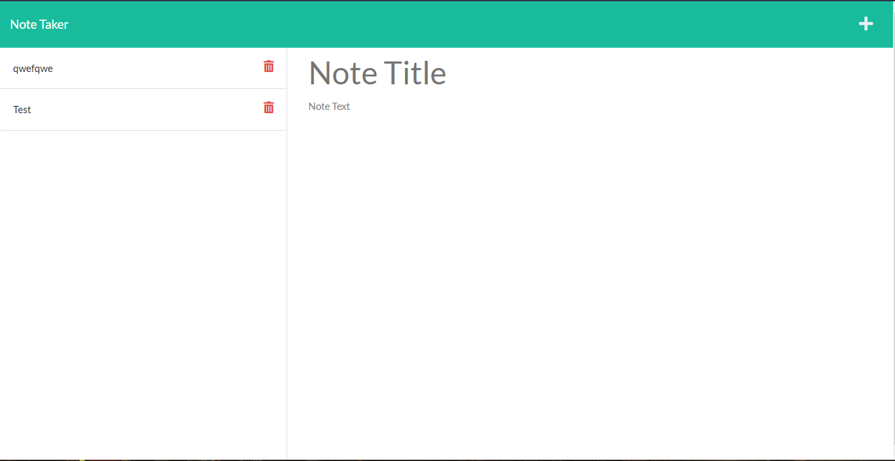

# Challange 11 Note taker

The challenge required students to modify starter code to create an application called Note Taker that can be used to write and save notes. This application will use an Express.js back end and will save and retrieve note data from a JSON file.

The file consists of a db folder which has the schema.sql file, public folder which consists of a public folder with the sites, a routes folder which links the back end with the UI and a server js file that initialises the server to run together.

Contents: - JS, Node, html/css/js (front end)

The file should be accessable from the https link: <https://ryanzade.github.io/Challenge-11/>

My GitHub: <https://github.com/RyanZade>
